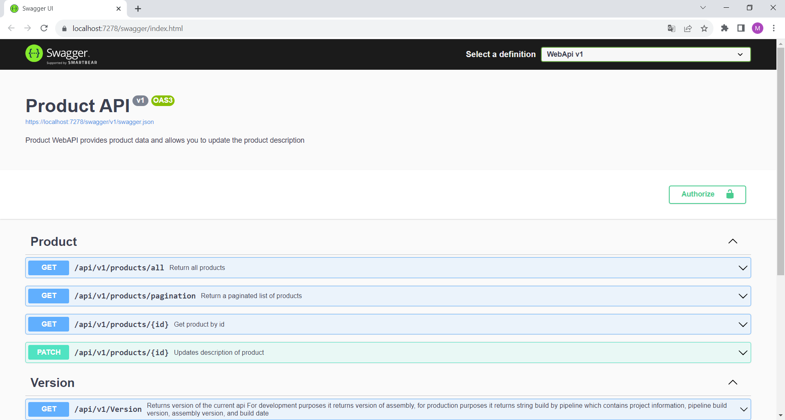
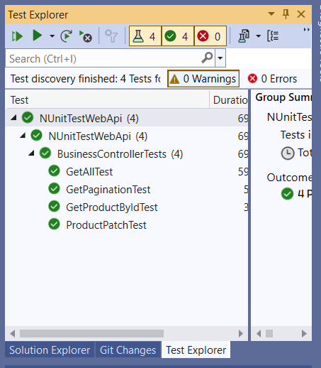
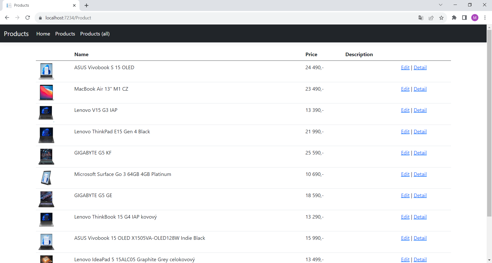

# ASP.NET Core WebApi with Unit tests and web client in ASP.NET Core MVC in .NET 7.0

This repository contains simple WebAPI products, Unit tests for all business functions and a simple web client.

WebAPI contains GET and PATCH endpoints. GET comes in several versions, get all, get paginated list and get by id.

See the examples here:

``` https://localhost:7278/swagger ```



Unit tests can be run in Visual Studio



``` https://localhost:7234/Product ```



Before starting, it is necessary to change the connection string to the database in the appsettings.json file of the WebApi project. 
Set the connection string to MSSQL DB server with read and write permissions.

``` "WebApiDB": "Data Source=your SQL server;Encrypt=False;Initial Catalog=WebApi;Persist Security Info=True;Integrated Security=true" ```
